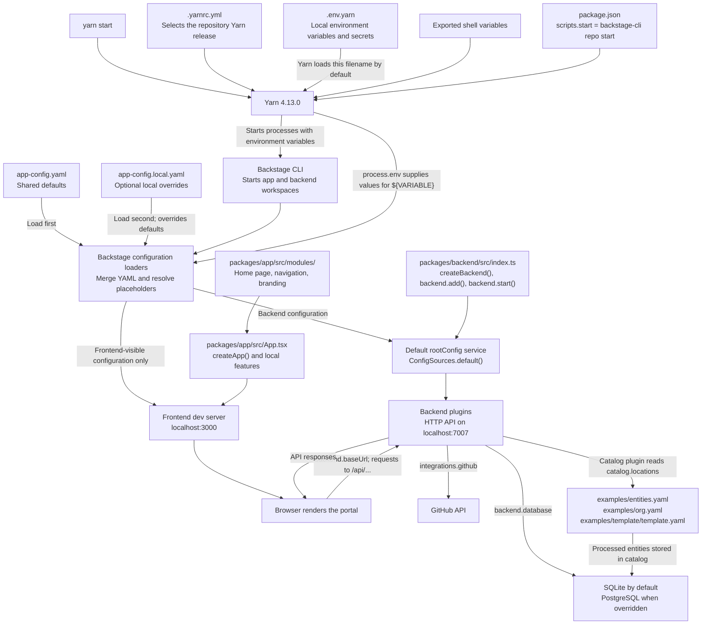

# Backstage IDP

My workspace for learning Backstage, adding features, and hosting a developer portal.

## Start the app

Run commands from the **repository root**. Use **Node.js 24** (Node 22 is also
supported for development) and the repository's **Yarn 4.13.0**.

```sh
# First run / after pulling dependency changes
corepack enable
yarn install --immutable

# Start frontend + backend
yarn start
```

Open **<http://localhost:3000>**. The backend runs at **<http://localhost:7007>**. All actions are here: **http://localhost:3000/create/actions**
Stop with `Ctrl+C`.

| Command              | When to use it                                      |
| -------------------- | --------------------------------------------------- |
| `yarn start app`     | Run only the frontend.                              |
| `yarn start backend` | Run only the backend.                               |
| `yarn tsc`           | Check TypeScript after code changes.                |
| `yarn lint:all`      | Lint all workspaces.                                |
| `yarn test`          | Run workspace tests.                                |
| `yarn new`           | Scaffold a plugin or module.                        |
| `yarn build:backend` | Build the backend and bundled frontend for hosting. |

Local login uses **GitHub** when the local override is present. The shared database default is **in-memory SQLite**;
`app-config.local.yaml` can override it with PostgreSQL. The database you configure
must be running and reachable; Backstage does not start PostgreSQL for you.

### Docker

For development, Docker Compose runs the frontend, backend, and PostgreSQL:

```sh
# Populate .env.yarn first; see docs/how-to-host.md for required variables.
docker compose up --build
```

Open <http://localhost:3000>. Source edits reload automatically. Secrets come from
`.env.yarn` at runtime and are excluded from image builds. PostgreSQL data and
container dependencies use named volumes. Stop with `docker compose down`.

For production, build Backstage on the host (or CI runner), then package it:

```sh
yarn install --immutable
yarn tsc
yarn build:backend --config ../../app-config.yaml
docker build --target production -t backstage:local .
docker run --rm --init --env-file .env.yarn \
  -e APP_BASE_URL=http://localhost:7007 \
  -p 127.0.0.1:7007:7007 backstage:local
```

CI builds pull requests and publishes `<dockerhub-username>/chaos-generator:<6-character-sha>`
on pushes to `main` and manual runs. Deploy that exact image tag. The shared Dockerfile provides separate `development` and `production` targets;
Compose selects `development`.

The production image needs a reachable PostgreSQL server; it does not include one.
Use your HTTPS portal URL for `APP_BASE_URL` when deploying.
See [Build and host](docs/how-to-host.md) for secrets, OAuth callbacks, and validation.

## Trace configuration from files to the running app

This diagram follows `yarn start` from the repository root, without `--config`
arguments or `BACKSTAGE_ENV`. Paths are relative to the repository root.



**YAML does not read `.env.yarn`.** Yarn reads `.env.yarn` before launching
Backstage. Backstage replaces `${VARIABLE}` with the corresponding environment
value. A plain `.env` file is not automatically loaded by this setup. Starting
the backend directly with `node` also skips Yarn's environment-file loading.

For example, this value passes through three stages:

1. `.env.yarn` defines `POSTGRES_HOST=localhost`.
2. Yarn supplies `process.env.POSTGRES_HOST` to the Backstage processes.
3. `host: ${POSTGRES_HOST}` in `app-config.local.yaml` becomes the host used by
   the backend database service.

The config loaders live in Backstage dependencies, so there is no handwritten
`readFile('app-config.yaml')` in this app. On the backend, `createBackend()` uses
the default `rootConfig` service from `@backstage/backend-defaults`, which calls
`ConfigSources.default()` from `@backstage/config-loader`. Frontend CLI tooling
loads configuration and exposes only schema-approved frontend settings to the
browser. Plugin code reads settings through Backstage's config APIs.

### Which file should I change, and who reads it?

| File or directory                                                                                                         | Change it for                                                 | Read or consumed by                                                                              |
| ------------------------------------------------------------------------------------------------------------------------- | ------------------------------------------------------------- | ------------------------------------------------------------------------------------------------ |
| [package.json](package.json)                                                                                              | Root commands, workspaces, shared tooling, Yarn version       | Yarn; `yarn start` invokes Backstage CLI                                                         |
| [.yarnrc.yml](.yarnrc.yml)                                                                                                | Yarn settings and the pinned Yarn binary                      | Yarn before running commands                                                                     |
| `.env.yarn` at the root                                                                                                   | Local values such as `POSTGRES_*` and `GITHUB_TOKEN`          | Yarn; values become child-process environment variables                                          |
| [app-config.yaml](app-config.yaml)                                                                                        | Shared URLs, auth, integrations, catalog sources, UI settings | Backstage config loaders, then the services and plugins using each section                       |
| `app-config.local.yaml` at the root                                                                                       | Local overrides, such as PostgreSQL connection settings       | Backstage config loaders after the shared file during default local startup                      |
| [app-config.production.yaml](app-config.production.yaml)                                                                  | Hosted URLs, PostgreSQL, container catalog paths              | Backstage when explicitly selected, as in the Docker command below                               |
| [packages/backend/src/index.ts](packages/backend/src/index.ts)                                                            | Register backend plugins and modules                          | Backend startup; `backend.add(...)` registers features that consume config and provide APIs      |
| [packages/app/src/App.tsx](packages/app/src/App.tsx)                                                                      | Register local frontend features                              | Frontend build/dev tooling; `createApp(...)` assembles the app                                   |
| [packages/app/src/modules/](packages/app/src/modules/)                                                                    | Home widgets, navigation, branding                            | Frontend imports from `App.tsx` and its modules                                                  |
| [packages/app/package.json](packages/app/package.json) and [packages/backend/package.json](packages/backend/package.json) | Dependencies and commands for each workspace                  | Yarn and Backstage CLI; frontend discovery also uses installed packages with `app.packages: all` |
| [examples/](examples/)                                                                                                    | Sample entities, users/groups, templates, template content    | Catalog reads configured YAML locations; scaffolder reads template content when a task runs      |
| [catalog-info.yaml](catalog-info.yaml)                                                                                    | Catalog metadata describing this portal                       | Catalog only after this file is registered or included in a configured source                    |
| [Dockerfile](Dockerfile)                                                                | Container files, build steps, production startup command      | Docker during build; Node runs the backend when the container starts                             |

Adding YAML settings does not install or register a backend plugin. Add the
dependency to its workspace and register it in `packages/backend/src/index.ts`.

### Override rules and production startup

- With default local startup, `app-config.local.yaml` overrides
  `app-config.yaml`. Objects merge; arrays replace earlier arrays rather than
  appending to them. This matters for `catalog.locations` and `integrations.github`.
- `APP_CONFIG_` environment variables override file settings. For example,
  `APP_CONFIG_app_title` directly overrides `app.title`. Ordinary variables such
  as `POSTGRES_HOST` need a `${POSTGRES_HOST}` reference in the YAML.
- Explicit `--config` arguments replace the default file selection. Include
  every file you want; later files take precedence.
- `BACKSTAGE_ENV=production` selects `app-config.production.yaml` between the
  shared and local files during default loading. `NODE_ENV=production` alone
  does not select that file.

The Dockerfile starts the backend with:

```sh
node packages/backend --config app-config.yaml --config app-config.production.yaml
```

That command does not load `app-config.local.yaml` or `.env.yarn`. Supply secrets
through the container's runtime environment. The app backend serves the built
frontend; the production config uses `APP_BASE_URL` for both public URLs and CORS.

### Where to look when a request fails

| Symptom                                           | First place to inspect                                                                                                                    |
| ------------------------------------------------- | ----------------------------------------------------------------------------------------------------------------------------------------- |
| Missing environment variable                      | `.env.yarn`, its exact variable name, and whether you launched with Yarn; restart after changing environment values                       |
| Database connection failure                       | `backend.database` in the effective config, `POSTGRES_*` values, and PostgreSQL availability                                              |
| Browser API requests reach the wrong host or port | Failed request URL in browser Network tools; compare it with `backend.baseUrl`                                                            |
| `/api/...` returns 404                            | The exact URL, backend startup errors, and registration of that backend plugin in `packages/backend/src/index.ts`                         |
| GitHub returns 401, 403, or 404                   | `integrations.github`, `GITHUB_TOKEN`, repository URL, and token access; private resources can return 404 when access is missing          |
| Catalog entities do not appear                    | `catalog.locations`, source YAML, and catalog processing errors; local file targets are relative to the backend process working directory |
| UI configuration has no effect                    | `app.extensions`, frontend feature registration, and the config files selected at startup                                                 |

Backend startup logs include `Loading config from ...`; use that line to confirm
which files were selected. A 404 alone does not establish that secrets failed to
load: identify the responding server and failing endpoint first.

## Files to remember

| Location                                                                                                                | What goes here                                                                                                        |
| ----------------------------------------------------------------------------------------------------------------------- | --------------------------------------------------------------------------------------------------------------------- |
| [app-config.yaml](app-config.yaml)                                                                                      | Shared settings: plugins, catalog sources, URLs, integrations, and UI extensions.                                     |
| `app-config.local.yaml` (create at the root)                                                                            | Your local overrides and secrets; gitignored.                                                                         |
| [app-config.production.yaml](app-config.production.yaml)                                                                | Hosting overrides: public URLs, PostgreSQL, and container catalog paths.                                              |
| [packages/backend/src/index.ts](packages/backend/src/index.ts)                                                          | Register backend plugins and modules with `backend.add(...)`.                                                         |
| [packages/app/src/App.tsx](packages/app/src/App.tsx)                                                                    | Register local frontend features; installed plugins can also be discovered automatically.                             |
| [packages/app/src/modules/](packages/app/src/modules/)                                                                  | Custom home widgets, sidebar, and logos.                                                                              |
| [packages/app/package.json](packages/app/package.json) / [packages/backend/package.json](packages/backend/package.json) | Install dependencies in the workspace that uses them. Root [package.json](package.json) holds shared scripts/tooling. |
| [catalog-info.yaml](catalog-info.yaml)                                                                                  | Catalog metadata describing this portal; it still needs registering.                                                  |
| [examples/](examples/)                                                                                                  | Sample services, users/groups, and software template files.                                                           |
| [plugins/](plugins/)                                                                                                    | Your own reusable plugins/modules.                                                                                    |
| [Dockerfile](Dockerfile)                                                              | Container packaging.                                                                                                  |

## Where do configs and environment variables go?

- Put shared, non-secret settings in `app-config.yaml`.
- Put personal overrides in a root `app-config.local.yaml`.
- `${GITHUB_TOKEN}` in YAML reads an environment variable from the process running
  Backstage. Export it before `yarn start`, or override the integration token in
  `app-config.local.yaml`. A `.env` file is **not automatically loaded**.
- Production needs `POSTGRES_HOST`, `POSTGRES_PORT`, `POSTGRES_USER`, and
  `POSTGRES_PASSWORD`, plus credentials for your integrations. Set these through
  the hosting platform.

See [configuration and secrets](docs/how-to-configure.md) for examples and override rules.

## How do I…?

For PostgreSQL running in WSL, see [Connect Windows pgAdmin to the WSL database](docs/local-dev/wsl-db-win-pgadmin.md).

| Task                                             | Guide                                                         |
| ------------------------------------------------ | ------------------------------------------------------------- |
| Install and register a plugin                    | [Add a plugin](docs/how-to-add-plugin.md)                     |
| Connect GitHub for discovery or project creation | [Connect GitHub](docs/how-to-connect-github.md)               |
| Set config, secrets, or environment variables    | [Configure the app](docs/how-to-configure.md)                 |
| Add a service, API, user, or group               | [Add catalog entities](docs/how-to-add-catalog-entities.md)   |
| Create a project from a template                 | [Add a software template](docs/how-to-add-template.md)        |
| Change the home page, sidebar, or branding       | [Customize the frontend](docs/how-to-customize-frontend.md)   |
| Set up login and permissions                     | [Configure authentication](docs/how-to-configure-auth.md)     |
| Add service documentation                        | [Set up TechDocs](docs/how-to-add-techdocs.md)                |
| Configure search, Kubernetes, or an API proxy    | [Connect other capabilities](docs/how-to-connect-services.md) |
| Build a container and host Backstage             | [Build and host](docs/how-to-host.md)                         |
| Debug a failure or run checks                    | [Troubleshoot](docs/troubleshooting.md)                       |

This app uses Backstage's **new frontend and backend systems**. Check that tutorials
match these systems before copying wiring examples.
